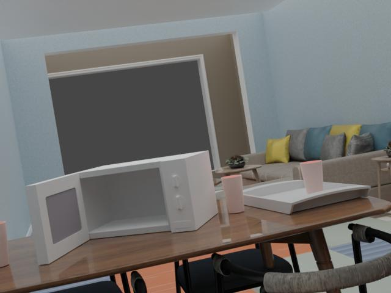

# Automate Semantic Relations




This example shows how to generate a random placement of 3 different objects (microwave, mug and tray) in a specific room provided by the 3D-FRONT dataset. After that placement, the algorithm registers the relations between the objects placed in the scene (on, inside), as well as special attributes as in the case of the microwave, which could be opened or closed.


## Usage

Execute in the Blender-Pipeline main directory:

```
python3 cli.py run examples/advanced/automate_semantic_relations/main.py {PATH_TO_3D-Front-Json-File} {PATH_TO_3D-Future} {PATH_TO_3D-Front-texture} {PATH_TO_ODB_Objects} /home_local/plaz_ju/odb examples/advanced/automate_semantic_relations/Test/ {h5_file_name} --include_base_object
``` 

* `examples/advanced/automate_semantic_relations/main.py`: path to the main python file to run.
* `PATH_TO_3D-Front-Json-File`: path to the 3D-Front json file
* `PATH_TO_3D-Future`: path to the folder where all 3D-Future objects are stored
* `PATH_TO_3D-Front-texture`: path to the folder where all 3D-Front textures are stored
* `PATH_TO_ODB_Objects`: path to the folder where the objects to insert are stored
* `/home_local/plaz_ju/odb examples/advanced/automate_semantic_relations/Test/`: Output directory
* `h5_file_name`: Name of the main file, which stores the relations data

Optionals:

* `--prioritize_relations`: Prioritize objects that generate relations
* `--objects_focused`: Avoid looking away from objects
* `--include_base_object`: Considerate the base objects (tables, desks, ...) as relation generators

Example:

```
python3 cli.py run examples/advanced/automate_semantic_relations/main.py /volume/reconstruction_data/datasets/3d_front/release/3D-FRONT/10087356-5564-4bb8-9dcd-72adee753630.json /volume/reconstruction_data/datasets/3d_front/release/3D-FUTURE-model /volume/reconstruction_data/datasets/3d_front/release/3D-FRONT-texture /home_local/plaz_ju/odb examples/advanced/automate_semantic_relations/Test/ h5_file_name --include_base_object
``` 

## Visualization

The rendered image as shown above can be found in the output directory.

```
python3 cli.py vis hdf5 examples/advanced/automate_semantic_relations/Test/*.hdf5
```

The file that stores the relations data is a `.h5` file.

## Implementation

### Load Dataset objects

```python
room_objs = bproc.loader.load_front3d(
    json_path=args.front,
    future_model_path=args.future_folder,
    front_3D_texture_path=args.front_3D_texture_path,
    label_mapping=mapping
)
```

### Place Objects in the loaded room

```python
for  base_obj in sample_surface_objects:

    
    
    # The loop starts with and UndoAfterExecution in order to clean up the cam poses from the previous iteration and
    # also remove the dropped objects and restore the sliced up objects.
    
    with bproc.utility.UndoAfterExecution():

        store_relations_and_features = {"relation": [], "attribute": []} # store_relations_and_features of the placed objects
                                                                        # attributes like "open" for the microwave

        # Select the surfaces, where the object should be sampled on
        objects_boxes = []
        dropped_object_list = []
        placed_obj_counter_static = placed_obj_counter
        
        base_object_dict = {"name": False, "tags": [True,    False], "surface_distance": False}
        
        
        placed_obj_counter = bproc.object.sample_scene_graph(base_obj, base_object_dict, objects_of_interest, objects_boxes, 
                                                                    dropped_object_list, placed_obj_counter, bvh_cache, room_objs,
                                                                    store_relations_and_features, verbose=False,max_n_tries=8, 
                                                                    max_n_obj=4, dropped_objects_types=[], 
                                                                    include_base_object=args.include_base_object,
                                                                    prioritize_relations=args.prioritize_relations)
        
        if not dropped_object_list:
            continue
```

### Find suitable camera poses to record the scene

```python
for number_of_cycles, visible_objects_threshold in zip(tries, thresholds):
            
    cam_counter, objects_on_frames_temp = suitable_camera_poses(number_of_cycles, objects_location, objects_size, radius_min, radius_max,
                                                                visible_objects_threshold, dropped_object_list, cam_counter, args.objects_focused)
    objects_on_frames.extend(objects_on_frames_temp)
    if cam_counter == desired_number_of_camera_poses:
        break

if cam_counter == 0:
    print(f"Image with the object {base_obj.get_name()} as a main parent has been skipped, since there are no suitable camera poses")
    continue
```

### Render the images

```python
bproc.renderer.enable_segmentation_output(map_by=["category_id", "instance"])

data = bproc.renderer.render()
```

### Generate relations file

```python
bproc.writer.write_scene_graph(args.output_dir, args.h5_file_name, dropped_object_list, objects_on_frames, 
                                       data, store_relations_and_features)

bproc.writer.write_hdf5(args.output_dir, data, append_to_existing_output=True)
```
